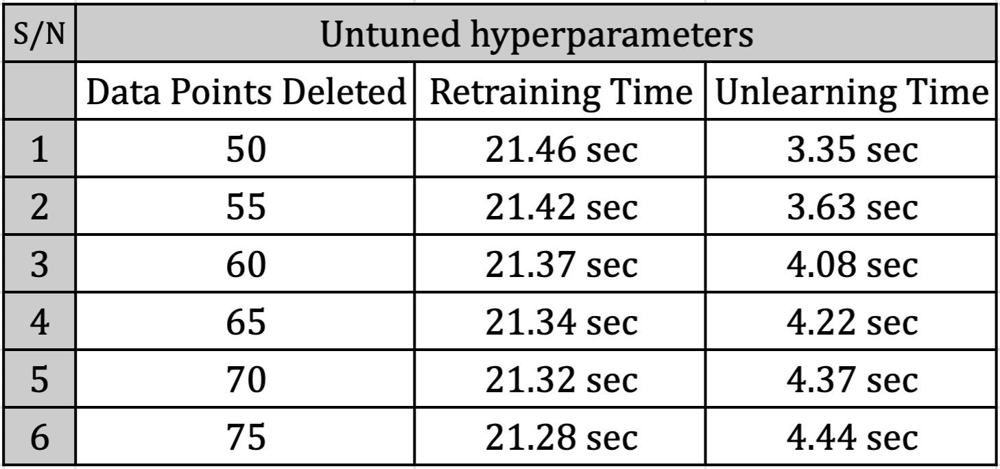
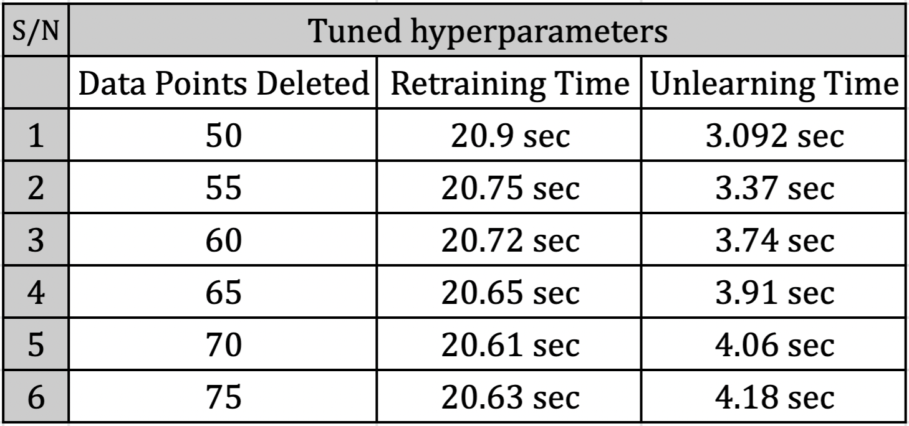

# Introduction

There is a rising need for users to safeguard their footprints by
forcing search engines to remove their links about them from the past.
The *Right to be forgotten* law which is General Data Protection
Regulation(GDPR) and California Consumer Privacy Act(CCPA) addresses
these issues and strives to enforce security and maintain the privacy of
both individuals and community by and large.

Large organizations that consume and process public data are obligated
to respect these laws and maintain the privacy and security of the
users. In most cases, the organizations train machine learning models on
these large data sets, and the problem arises when a part of the
training data set decides to move out of the system and requests to
erase their data, data lineage, any traces of their data along with its
influence or contribution in training the machine learning model.
Organizations around the world use diverse strategies to implement
machine unlearning. A naive approach is to retrain a model from scratch,
but it becomes computationally and resourcefully expensive in the case
of large datasets.

In this project, we have chosen variant of randomized decision tree
machine learning model which is DaRE and implemented machine unlearning
without retraining the whole model. In the subsequent sections, we will
evaluate computational feasibility and robustness of the machine
unlearning using DaRE model against complete retraining. For evaluation,
we will use quantifying metrics which are unlearning time computation,
space overhead and effect of tuning hyper-parameters. In addition, we
will test the membership inference attacks on the deleted instances to
validate the claim of guaranteed unsuccessful membership inference
attacks on deleted instances.

# Background and Related Work

During the process of the work survey, we studied numerous pieces of
literature, and we observed multiple approaches and strategies being
used to achieve machine unlearning. For this project, we decided to work
on the specific machine learning model type, the randomized decision
tree. We referred to the paper "Humans Forget, Machines Remember\"
[@eduardf1] to clearly understand and learn the legal background behind
the Right to Be Forgotten. The technical papers that are strongly
related to unlearning of Randomised decision tree were "Brophy and Lowd,
Machine Unlearning for Random Forests\" [@Brophy] and "Schelter et al.
HedgeCut: Maintaining Randomised Trees for Low-Latency Machine
Unlearning\" [@Schelter] which emphasize on ensembling of small
randomized decision trees to achieve low latency machine unlearning for
classification type problems. We also referred to the literature "DART:
Data Addition and Removal Trees\" [@BrophyDart] which proposes a variant
of Random Forests that supports the addition or removal of data. We
believe "HedgeCut\" and "data removal-enabled forests\" (DaRE) are some
of the efficient unlearning techniques developed for tree-based models.

Based on our findings from the above cited research papers especially,
we were motivated to investigate further into the machine unlearning for
DaRE models implemented in this paper [@Brophy] with focus on three key
aspects. First is the operating limits and robustness of the unlearning
solution by finding the threshold up to which data points can be removed
while retaining the accuracy of the model in comparison to the
completely retrained model. Secondly, to test the feasibility of the
batch deletion through successive single instance deletions and validate
claims of membership inference attacks.

# Approach

We analyzed and studied the frameworks DARE and DART, thereby
refactoring the strategy to build a model with support for single
instance deletion unlearning and batch unlearning through sequential
deletion.

For the computation and building of the model, we have used the local
system running on Ubuntu 20.2 with Intel i5-10600K processor,16 GB
memory and NVIDIA 3070ti Graphics.

We measure the speedup of the generated unlearned model in comparison
with the completely retrained model. Speedup is the ratio of time for
generating the model (unlearning vs. retraining). We evaluate the delta
between the unlearned model and retrained model accuracy on the test
data. We choose random data points to be deleted uniformly. We aim to
achieve speedup by a factor of two on average and have delta error
within 5% with respect to the unlearned vs. retrained model.

## Dataset(s)

We plan to work with the following privacy-sensitive datasets: [Census
Income Dataset](https://archive.ics.uci.edu/ml/datasets/adult)[^1] which
predicts whether the annual income of an individual exceeds 50k USD,
based on census data. [Bank Marketing
Dataset](https://archive.ics.uci.edu/ml/datasets/bank+marketing)[^2]
which predicts whether the client will subscribe a term deposit or not
and [App Behavior
Dataset](https://www.kaggle.com/hkhamnakhalid/customers-to-subscription-through-app-behavior)[^3]
which predicts new customer who is interested in buying the product or
not.

## Plan of Action

-   We started with the technical analysis of the paper referenced
    Jonathan Brophy and Lowd Daniel on Machine unlearning for random
    forests [@Brophy]. We built our own version of DaRE and implemented
    in python and built its relevant dependencies.

-   In addition to the datasets used in the experimentation, we chose
    our own new dataset. [App Behavior
    Dataset](https://www.kaggle.com/hkhamnakhalid/customers-to-subscription-through-app-behavior)
    which was not used in the original experimentation, to validate the
    claims.

-   Through experimentation, we determined the optimal size of the
    dataset (threshold) which can be unlearned for which unlearning time
    is less than the retraining time, which was not originally covered
    in the scope of the paper by Jonathan Brophy and Lowd Daniel
    [@Brophy].

-   We performed time and space overhead analysis and tuned the
    hyperparameters ($d_{rmax}$ and $k$) to improve the speedup and
    potentially extended the threshold for optimal deletion size.

-   In addition, we validated the claim *deletions in random forest are
    exact, so Membership Inference attack is guranteed to be
    unsuccessful* by implementing Membership Inference attack on DaRE
    model which was a part of discussion and left for future scope.

## Experiments and Validations

-   After successfully implementing the DaRE, we performed the
    unlearning experiments for three data sizes, ie. **small**,
    **medium** and **large** for each dataset used for experimental
    purpose.

-   Originally the DaRE model was overfitted on **app behavior
    analysis**, we tuned the parameters to avoid the overfitting.

-   We faced some **challenges** in experimenting with the **app
    behaviour analysis** after data preprocessing using
    **columntransformer** with kmeansdiscretizer, we obtained large
    number of columns with one hot encoding which required high compute
    time for model training. We resolved this issue by performing data
    visualization followed by feature selection which successfully
    reduced the computation time.

-   We tuned the following hyperparameters which are the maximum depth
    of each tree $d_{max}$ (greedy) and $d_{rmax}$ (random) , the number
    of trees in the forest T and the number of thresholds considered per
    attribute for greedy nodes $k$.

-   From the previous work done by Brophy and Daniel and from our own
    experiments we identified that increasing $d_{rmax}$ (random) and
    reducing $k$, can improve the speedup of the DaRE at the cost of
    small loss in the predictive performance for small number of
    unlearning samples (\>1%) and for large data deletions, we keep
    tuning the hyper parameters to produce similar results and to obtain
    optimal values of $d_{rmax}$ and $k$ respectively.

-   Space Overhead Computation: To test the impact of space consumption,
    we performed the space overhead analysis by comparing our version of
    DaRE with the ScikitLearn random forest.

-   Implementation of Membership Inference Attack: We performed two
    attacks which are Shokri attack and Loss attack 2. We took into
    account all three datasets and trained the samples. We deleted some
    samples used in the training set from the each of the datasets and
    evaluated above chosen Membership Inference attacks on the deleted
    samples to check whether they were able to predict whether these
    samples were a part of the training set or not.

{#fig:censusincome-results-1
width="\\textwidth"}

[]{#fig:censusincome-results-1 label="fig:censusincome-results-1"}

{#fig:bankmarketing-results-1
width="\\textwidth"}

[]{#fig:bankmarketing-results-1 label="fig:bankmarketing-results-1"}

{#fig:appbehaviour-results-1
width="\\textwidth"}

[]{#fig:appbehaviour-results-1 label="fig:appbehaviour-results-1"}

{#fig:speeduptime width="\\textwidth"}

{#fig:sub1
width=".9\\linewidth"}

{#fig:sub2
width=".9\\linewidth"}

{#fig:memusagebankmarketing
width="\\textwidth"}

{#fig:memusagecensusincome
width="\\textwidth"}

{#fig:memusageappbehviour
width="\\textwidth"}

{#fig:MIA-attacks width="3 in"}

{#fig:graph-bankmarketing
width="6.5 in"}

{#fig:graph-censusincome
width="6.5 in"}

{#fig:graph-appbehaviour
width="6.5 in"}

# Results

-   Post unlearning we computed confusion matrix followed by precision,
    recall and accuracy scores. We compared the performance of unlearned
    model vs. completely retrained model for three datasets to produce
    the following results in the
    tables [1](#fig:censusincome-results-1){reference-type="ref"
    reference="fig:censusincome-results-1"}, [2](#fig:bankmarketing-results-1){reference-type="ref"
    reference="fig:bankmarketing-results-1"}
    and [3](#fig:appbehaviour-results-1){reference-type="ref"
    reference="fig:appbehaviour-results-1"} .

-   We find that the generalization error does not vary significantly
    and the model is able to unlearn data in 3-4 orders of magnitude
    faster than retraining from scratch while sacrificing less than 1%
    in terms of predictive performance for which results are reported
    in [4](#fig:speeduptime){reference-type="ref"
    reference="fig:speeduptime"}.

-   We observed as we increase the number of indices to be removed the
    speedup is less significant as compared to retraining the left
    portion and its better to actually retrain rather than unlearn which
    roughly happens when unlearning around 11$\%$ of dataset as evident
    from the analysis of computation time with varying percentage of
    elements deleted for all three datasets referenced
    in [11](#fig:graph-bankmarketing){reference-type="ref"
    reference="fig:graph-bankmarketing"}, [12](#fig:graph-censusincome){reference-type="ref"
    reference="fig:graph-censusincome"}
    and [13](#fig:graph-appbehaviour){reference-type="ref"
    reference="fig:graph-appbehaviour"}.

-   Unlearning Time Speedup Analysis: We observed the improve in speedup
    for small data
    unlearning [\[fig:paramtuning\]](#fig:paramtuning){reference-type="ref"
    reference="fig:paramtuning"}, but did not see the same results being
    reproduced as we increase the unlearning size shown.

-   Space Computation Analysis: Our experimental findings match with the
    theoretical claims as we observed an overhead in space consumption
    by a factor of 3-10 when compared to the simple random forest by the
    scikit learn for which the results
    are [7](#fig:memusagebankmarketing){reference-type="ref"
    reference="fig:memusagebankmarketing"},
     [8](#fig:memusagecensusincome){reference-type="ref"
    reference="fig:memusagecensusincome"}
    and [9](#fig:memusageappbehviour){reference-type="ref"
    reference="fig:memusageappbehviour"}.

-   Membership Inference Attack Analysis: We formulated the attack
    accuracy results shown
    in [10](#fig:MIA-attacks){reference-type="ref"
    reference="fig:MIA-attacks"} and found that the attack accuracy
    results for Shokri and Loss Attack 2 are in the range (26%-40%) for
    all the three datasets. This complements the failure of the
    membership inference attacks to predict the deleted samples in or
    out of the training set. Considering the data deletions as exact in
    the DaRE models, membership inference attacks failed and hence we
    validated the claim by the researchers that *data deletions in DaRE
    models are exact, membership inference attacks are guaranteed to be
    unsuccessful for instances deleted from the model*.

# Conclusions & Future work

We have successfully implemented DaRE, tested its robustness and
operating limits of unlearning by performing unlearning tests for
varying deletion size (small, medium, large). We performed time and
space analysis to understand DaRE and tuned hyper-parameters to avoid
overfitting and improve the speedup in order to achieve threshold for
optimal deletion greater than 11%. After the hyper-parameter tuning, we
noticed speedup in the unlearning for smaller data deletions but this
difference does not translate to the large data deletions. We find that
the claim holds true regarding membership inference attacks and
membership inference attacks are unsuccessful on DaRE model under black
box settings.

Future Work: We will try to bring down space overhead which will enhance
the performance of DARE in 11+% data unlearning cases. In addition to
that, we want to implement and test differential-private random forest
models, but the problem lies in the large privacy budget and
generalization error due to which they often suffer from poor predictive
performance.

[^1]: Census Income Dataset Link:
    <https://archive.ics.uci.edu/ml/datasets/adult>

[^2]: Bank Marketing Dataset Link:
    <https://archive.ics.uci.edu/ml/datasets/bank+marketing>

[^3]: App Behavior Dataset Link:
    [www.kaggle.com/hkhamnakhalid/customers-to-subscription-through-app-behavior](www.kaggle.com/hkhamnakhalid/customers-to-subscription-through-app-behavior){.uri}
